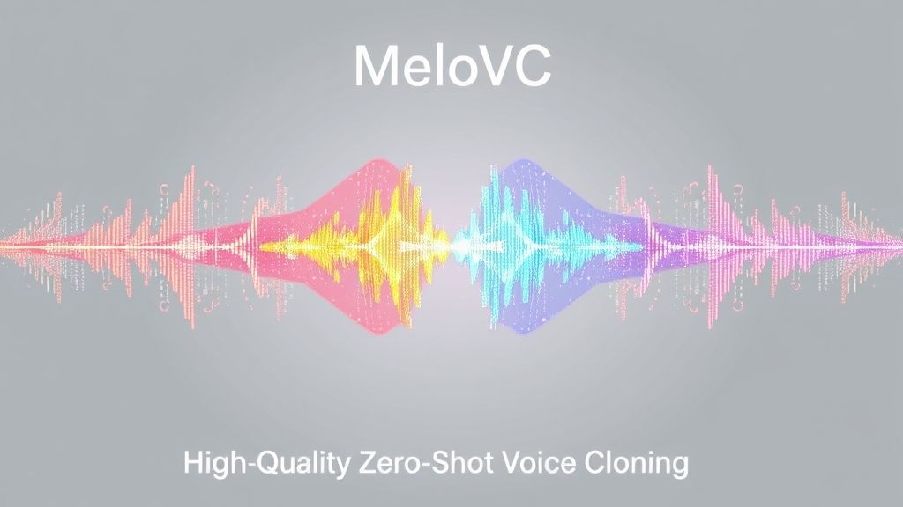

<div align="center">
  <div>&nbsp;</div>
   <br>
</div>

<p align="center">
  <a href="https://huggingface.co/your-username/your-model-name">
    
  </a>
  <a href="LICENSE">
    
  </a>
  <a href="#">
    
  </a>
</p>

## 介绍
**MeloVC** 是一个修改自 [MeloTTS](https://github.com/myshell-ai/MeloTTS) 的文本转语音（TTS）项目，专注于高质量的**中英双语**语音合成，并通过 **Speaker Embedding** 技术实现了零样本（Zero-Shot）声音克隆。

与原始 MeloTTS 不同，本项目不再使用 `speaker_id`，而是通过提取任意一段参考音频的声纹（Speaker Embedding）来控制生成语音的音色和风格。

**[English Version](./README_en.md)** 

# ✨ 主要特性

*   **高质量语音合成**：所有模型均在 44.1kHz 采样率下训练，提供清晰、自然的听感，以追求更高的音质。
*   **语言支持**：本项目专注于中英文，移除了对其他语言的支持，简化了模型结构。
*   **零样本声音克隆 (Zero-Shot Voice Cloning)**：基于 `speechbrain/spkrec-ecapa-voxceleb` 提取的 192 维 Speaker Embedding。仅需一段3秒的参考音频，这使得模型具备了强大的零样本声音克隆能力。同时支持无参考文本生成。
*   **中英双语支持**：深度优化了中英文混合文本的处理，发音更准确、流畅。
*   **易于使用的推理接口**：输入 `文本` + `参考音频` 或 `预提取的 Speaker Embedding` 即可进行推理。
*   **开源预训练多说话人模型**：V100 单核，训练24*3小时，见 [HuggingFace](https://huggingface.co/shichaog/MeloVC/)。
*   **数据集**：使用了不同的数据集组合进行训练，以优化特定场景下的表现。
    *   基于 200+ 小时 VoxBox 开源数据集和 16 小时私有数据混合训练，泛化能力和音色多样性更强。**由于数据量有限，克隆不同音色效果存在差异**。
        *   Ai-shell3 85小时
        *   hifi_tts   90小时
        *   ravdess   1小时
        *   vctk     41小时
        *   私有数据 16小时

# 🚀 快速开始

## 1. 环境安装

首先，克隆本仓库并安装所需的依赖。
```bash
git clone https://github.com/shichaog/MeloVC.git
cd MeloVC
pip install -e .
python -m unidic download
```

## 2. 推理示例

### 命令行

克隆

```
python infer.py --text "我最近在学习machine learning，希望能够在未来的artificial intelligence领域有所建树。"  -m /path/to/G_XXXX.pth -o ./
```

非克隆

```
python infer.py --text "我最近在学习machine learning，希望能够在未来的artificial intelligence领域有所建树。" --ref_audio_path XXXX.wav -m /path/to/G_XXX.pth -o ./
```

# 🔧 训练自己的模型

如果你想使用自己的数据集训练模型，或者微调模型请遵循以下步骤：

## 1. 安装环境

在训练前请先安装MeloVC到开发模式，然后到melovc目录下

```
pip install -e .
cd melovc
```

## 2. 数据准备

准备你的数据集，并创建一个 `metadata.list 文件，格式如下：

```
path/to/audio1.wav|LANGUAGE-CODE|这是第一段文本。
path/to/audio2.wav|LANGUAGE-CODE|This is the second text.
...
```

* 语言
  * 仅中文，LANGUAGE-CODE：ZH
  * 仅英文，LANGUAGE-CODE：EN
  * 中英文混合，LANGUAGE-CODE：ZH_MIX_EN

- 音频格式：推荐使用 44.1kHz 采样率的 WAV 文件。
- 文本：确保文本与音频内容对应，并已进行清洗，比如用ASR模型如（[whisper](https://github.com/openai/whisper)）检验文本。
- 为了效果，建议如下：
  - 单人训练，建议高质量总时长在10小时以上
  - 大规模人数，由于不方便统计单人时长，以数据量越多越好

在`data/example/metadata.list`目录下有一个例子可以参考。

在上述准备妥当之后，可以使用如下预处理命令代码：
```
python preprocess_text.py --metadata path/to/metadata.list --config_path path/to/config.json
```

这会提前计算训练时用到的bert、spectral、speaker Embedding信息，以加速训练的过程。在处理完成之后会在metadata.list同名目录下生成`config.json`、`train.list`、`val.list`文件，这里包括模型、训练以及数据相关信息。

## 3. 修改配置文件

复制并修改 `configs/config.json` 文件，主要关注以下部分：
- `data` -> `training_files`: 指向你的 `filelist.txt`。
- `data` -> `embedding_dir`: 指向你保存 Speaker Embedding 的目录（如果预计算了）。
- `train`: 调整 `batch_size`, `epochs` 等训练参数。

## 4. 开始训练

```
bash train.sh <path/to/config.json> <num_of_gpus>
如：bash train.sh path/to/your/config.json 1
```

这会在执行该命令的目录下生成logs目录，该目录中包含了训练的log以及checkpoint，可以使用tensorboard查看结果。在训练的时候会从Huggingface上下载模型文件 [HuggingFace](https://huggingface.co/shichaog/MeloVC/)。

# 作者

- [shichaog](https://github.com/shichaog/) 

如果你发现这个有用，请参与后续的迭代。

# 📜 许可证

本项目采用 Apache 2.0 License。
# 🙏 特别感谢

- 感谢[MeloTTS](https://github.com/myshell-ai/MeloTTS), [VITS](https://github.com/jaywalnut310/vits), [VITS2](https://github.com/daniilrobnikov/vits2) 和 [Bert-VITS2](https://github.com/fishaudio/Bert-VITS2).团队的原始工作。
- 感谢 [SpeechBrain](https://github.com/speechbrain/speechbrain)  提供了强大的预训练声纹提取模型。
- 感谢 [SparkAudio](https://github.com/SparkAudio/VoxBox) 数据集的开放。
