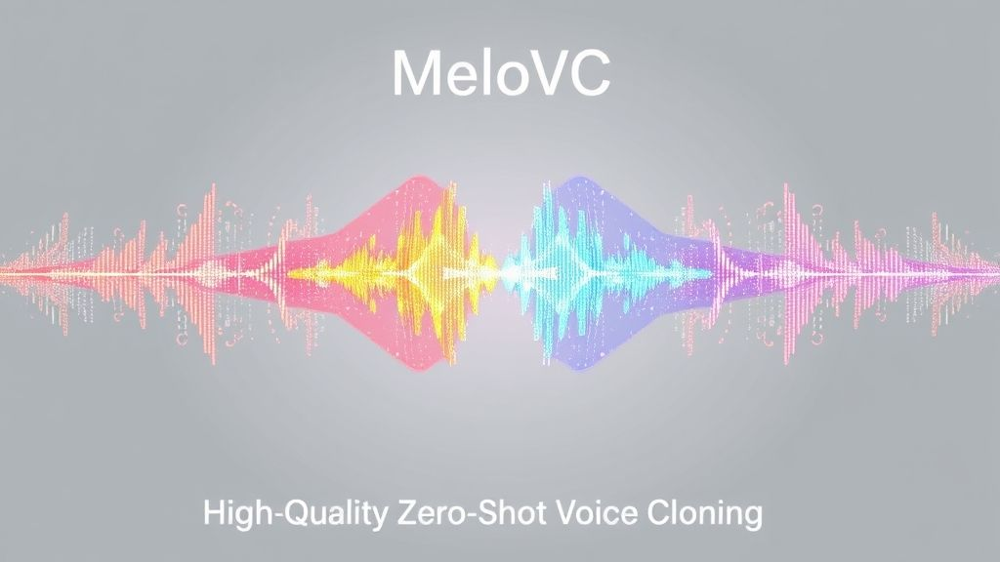

<div align="center">
  <div>&nbsp;</div>
   <br>
</div>

<p align="center">
  <a href="https://huggingface.co/your-username/your-model-name">
    
  </a>
  <a href="LICENSE">
    
  </a>
  <a href="#">
    
  </a>
</p>
- ## MeloVC
  **MeloVC** is a text-to-speech (TTS) project modified from [MeloTTS](https://github.com/myshell-ai/MeloTTS) , focusing on high-quality **bilingual (Chinese-English) **speech synthesis. It implements zero-shot voice cloning through **Speaker Embedding** technology.
  Unlike the original MeloTTS, this project no longer uses `speaker_id`. Instead, it controls the timbre and style of the generated speech by extracting a speaker embedding (voiceprint) from any given reference audio clip.

  ## ✨ Key Features
  - **High-Quality Speech Synthesis:** All models are trained at a 44.1kHz sampling rate, delivering a clear, natural auditory experience with superior audio quality.
  - **Focused Language Support:** This project specializes in Chinese and English, removing support for other languages to simplify the model architecture.
  - **Zero-Shot Voice Cloning:** Leverages 192-dimensional Speaker Embeddings extracted using `speechbrain/spkrec-ecapa-voxceleb`. It requires only a 3-second reference audio clip, giving the model powerful zero-shot voice cloning capabilities. It also supports generating speech in a default voice (without a reference audio).
  - **Bilingual Chinese-English Support:** Deeply optimized for handling mixed Chinese and English text, resulting in more accurate and fluent pronunciation.
  - **Easy-to-Use Inference Interface:**Perform inference simply by providing `text` + `reference audio` or a `pre-extracted Speaker Embedding`.
  - **Open-Source Pre-trained Multi-Speaker Model:** Trained for 72 hours (24*3) on a single V100 GPU. Available on  [HuggingFace](https://huggingface.co/shichaog/MeloVC/).
  - **Datasets:** Trained on a combination of different datasets to optimize performance in specific scenarios.
    - Trained on a mix of the 200+ hour open-source VoxBox dataset and 16 hours of private data, enhancing generalization and timbre diversity. **Note:** Due to the limited amount of data, the effectiveness of cloning different voices may vary.
      - Ai-shell3: 85 hours
      - hifi_tts: 90 hours
      - ravdess: 1 hour
      - vctk: 41 hours
      - Private data: 16 hours
  ## 🚀 Quick Start
  ### 1. Environment Setup
  First, clone this repository and install the required dependencies.
  ```
  git clone https://github.com/shichaog/MeloVC.git
  cd MeloVC
  pip install -e .
  python -m unidic download
  ```
  ### 2. Inference Examples
  #### Command Line
  Voice Cloning (using a reference audio)
  ```
  python infer.py --text "I'm learning machine learning recently, and I hope to make some achievements in the field of artificial intelligence in the future." --ref_audio_path /path/to/your/reference.wav -m /path/to/G_XXXX.pth -o ./cloned_output.wav
  ```
  Non-Cloning (using a default voice)
  ```
  python infer.py --text "I'm learning machine learning recently, and I hope to make some achievements in the field of artificial intelligence in the future." -m /path/to/G_XXXX.pth -o ./default_output.wav
  ```
  ## 🔧 Train Your Own Model
  If you want to train a model on your own dataset or fine-tune the existing model, follow these steps:
  ### 1. Setup Environment
  Before training, install MeloVC in editable (developer) mode and navigate to the `melovc` directory:
  ```shell
  pip install -e .
  cd melovc
  ```
  ### 2. Data Preparation
  Prepare your dataset and create a `metadata.list` file with the following format:
  ```shell
  path/to/audio1.wav|LANGUAGE-CODE|This is the first text.
  path/to/audio2.wav|LANGUAGE-CODE|这是第二段文本。
  ...
  ```
  - Language Codes:
    - Chinese only: `ZH`
    - English only: `EN`
    - Mixed Chinese & English: `ZH_MIX_EN`
  - Audio Format: WAV files with a 44.1kHz sampling rate are recommended.
  - Text: Ensure the text corresponds to the audio content. It's a good practice to clean the text and verify its accuracy using an ASR model like Whisper.
  - Recommendations for Best Results:
    - Single-speaker model: At least 10 hours of high-quality audio is recommended.
    - Large multi-speaker model: The more data, the better, as it's harder to track per-speaker duration.
    An example can be found at `data/example/metadata.list`.
    Once your data is ready, run the preprocessing script:
  ```
  python preprocess_text.py --metadata path/to/metadata.list --config_path path/to/config.json
  ```
  This will pre-compute the BERT, spectral, and speaker embedding information needed for training, which significantly speeds up the process. After processing, it will generate `config.json`, `train.list`, and `val.list` files in the same directory as your `metadata.list`. These files contain model, training, and data configurations.
  ### 3. Modify the Configuration File
  Copy and modify the `configs/config.json` file, paying close attention to the following sections:
  - `data` -> `training_files`: Point this to your `train.list` file.
  - `data` -> `embedding_dir`: Point this to the directory where you saved the Speaker Embeddings (if pre-computed).
  - `train`: Adjust training parameters like `batch_size`, `epochs`, etc.
  ### 4. Start Training
  ```
  bash train.sh <path/to/config.json> <num_of_gpus>
  # Example:
  bash train.sh path/to/your/config.json 1
  ```
  This will create a `logs` directory in the current path, containing training logs and model checkpoints. You can use TensorBoard to monitor the training progress. During the process, the script will download necessary model files from [HuggingFace](https://huggingface.co/shichaog/MeloVC/).
  ## Author
  - [shichaog](https://github.com/shichaog/) 
  If you find this project useful, please consider contributing to its future development.
  ## 📜 License
  This project is licensed under the Apache 2.0 License.
  ## 🙏 Acknowledgements
  - Special thanks to the teams behind [MeloTTS](https://github.com/myshell-ai/MeloTTS), [VITS](https://github.com/jaywalnut310/vits), [VITS2](https://github.com/daniilrobnikov/vits2) and [Bert-VITS2](https://github.com/fishaudio/Bert-VITS2)for their foundational work.
  - Thanks to [SpeechBrain](https://github.com/speechbrain/speechbrain)  for providing the powerful pre-trained speaker embedding extraction model.
  - Thanks to [SparkAudio](https://github.com/SparkAudio/VoxBox) team for making their dataset publicly available.
